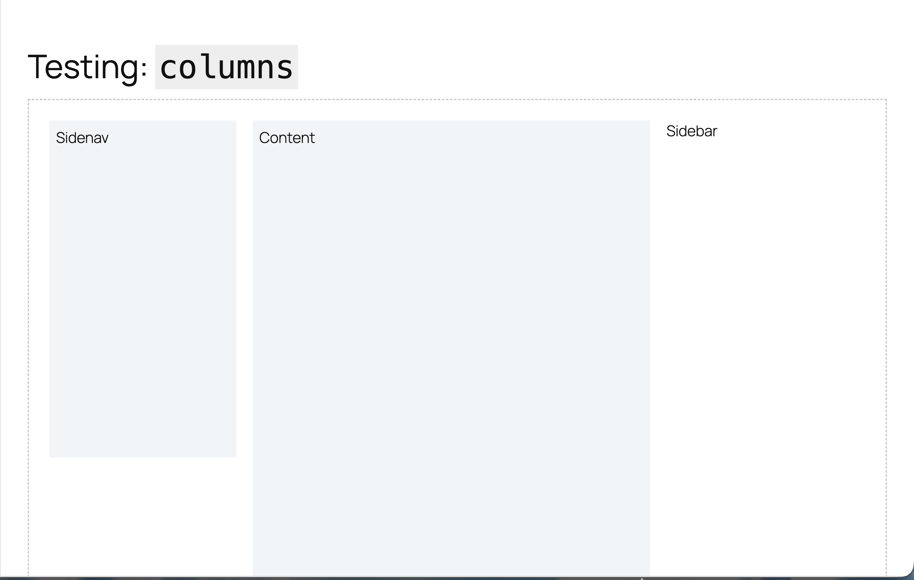

# Column and row

Sample usage -

```HTML
<tu-row no-wrap>
    <tu-column width="277px">
        <div style="box-sizing: border-box; height: 500px; background-color: #F1F5F8; padding: 10px;">
            Sidenav
        </div>
    </tu-column>
    <tu-column>
        <tu-row no-column-scroll>
            <tu-column grow="2">
                <div style="box-sizing: border-box; height: 800px; background-color: #F1F5F8; padding: 10px;">
                    Content
                </div>
            </tu-column>
            <tu-column>
                Sidebar
            </tu-column>
        </tu-row>
    </tu-column>
</tu-row>
```

Screenshot -


